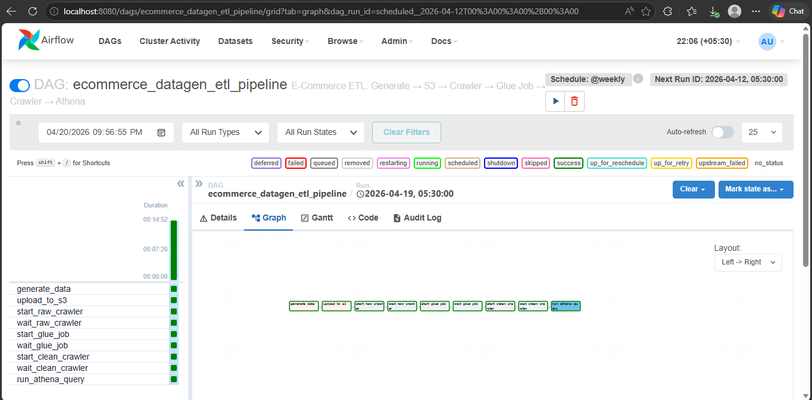
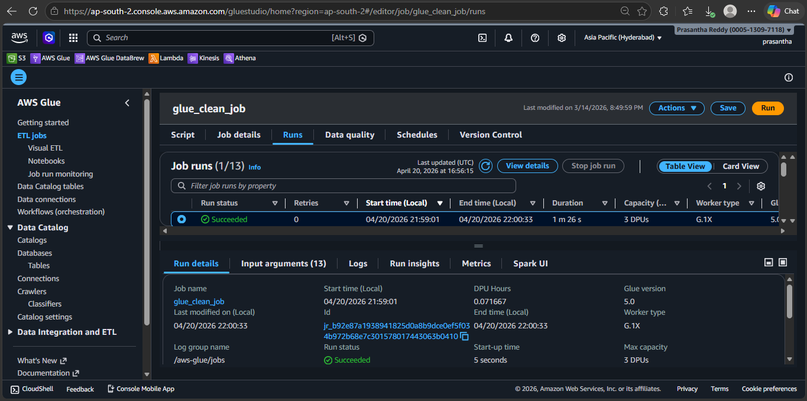
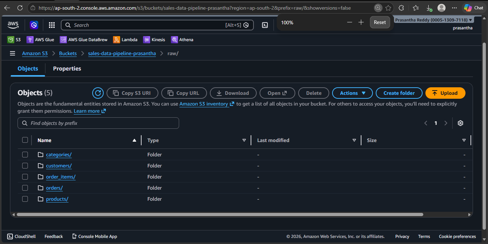

# E-Commerce ETL Pipeline

**Author:** Chereddy Prasantha Reddy  
**Stack:** Apache Airflow | AWS S3 | AWS Glue | AWS Athena | Python | PySpark | Docker

---

## Project Overview

An end-to-end cloud data engineering pipeline that generates realistic Indian e-commerce data,
orchestrates the full ETL workflow using Apache Airflow running in Docker,
cleans and transforms data with AWS Glue (PySpark), and enables serverless analytics via AWS Athena.

The pipeline generates **100,000 order items** across 5 relational tables with **~3% intentional dirty data**
to demonstrate real-world data cleaning capabilities.

**DAG ID:** `ecommerce_datagen_etl_pipeline`

---

## Pipeline Architecture

```
[Airflow DAG -- ecommerce_datagen_etl_pipeline]

    Task 1: generate_data       --> PythonOperator      --> Runs data_generator.py, generates 5 CSV tables
    Task 2: upload_to_s3        --> PythonOperator      --> Uploads CSVs to s3://bucket/raw/ via S3Hook
    Task 3: start_raw_crawler   --> GlueCrawlerOperator --> Triggers raw-data-crawler on S3 raw/ folder
    Task 4: wait_raw_crawler    --> GlueCrawlerSensor   --> Polls every 30s until crawler status = READY
    Task 5: start_glue_job      --> GlueJobOperator     --> Triggers glue_clean_job PySpark ETL script
    Task 6: wait_glue_job       --> GlueJobSensor       --> Polls every 30s until Glue job = SUCCEEDED
    Task 7: start_clean_crawler --> GlueCrawlerOperator --> Triggers processed_data_crawler on S3 clean/
    Task 8: wait_clean_crawler  --> GlueCrawlerSensor   --> Polls every 30s until crawler status = READY
    Task 9: run_athena_query    --> AthenaOperator      --> Runs revenue analytics SQL on clean tables
```

---

## Dataset

| Table | Rows | Description |
|---|---|---|
| categories | 7 | Static product categories (Electronics, Clothing, etc.) |
| products | 49 | 7 products per category with Indian market prices |
| customers | 14,285 | Indian locale -- names, cities, phone numbers (Faker en_IN) |
| orders | 50,000 | Linked to customers, weighted status distribution (70% completed) |
| order_items | 100,000 | Core fact table -- ~3% intentional dirty data injected |

### Dirty Data Injected (for Glue cleaning demo)

- **Invalid FK** -- product_id 9999 does not exist in products table
- **Negative quantity** -- physically impossible values
- **Future order dates** -- orders placed 10 days ahead

---

## Tech Stack

| Layer | Technology |
|---|---|
| Orchestration | Apache Airflow 2.9.0 (Docker -- LocalExecutor) |
| Data Generation | Python, Faker (en_IN locale), Pandas |
| Cloud Storage | AWS S3 (raw/ and clean/ zone architecture) |
| Cataloging | AWS Glue Crawler (dual-crawler architecture) |
| Transformation | AWS Glue ETL Job (PySpark) |
| Analytics | AWS Athena (serverless SQL) |
| Infrastructure | Docker, docker-compose |

---

## Folder Structure

```
ecommerce-etl-pipeline/
|-- dags/
|   |-- data_generator.py     # Generates all 5 CSV tables with Faker
|   `-- projectdag.py         # Airflow DAG -- ecommerce_datagen_etl_pipeline
|-- docs/
|   |-- screenshots/          # Pipeline evidence screenshots
|   `-- athena_queries.sql    # 5 analytics SQL queries
|-- plugins/                  # Empty (required by Airflow)
|-- .gitignore
|-- docker-compose.yml        # Airflow services configuration
|-- requirements.txt          # Python package versions
`-- README.md
```

---

## Pipeline Screenshots

### All 9 Tasks Completed Successfully


### Glue ETL Job Succeeded


### Athena Analytics Result


### S3 Raw Data Zone


---

## How to Run

### Prerequisites

- Docker Desktop installed and running (4GB+ RAM allocated)
- AWS account with S3, Glue, Athena access
- S3 bucket created (update `BUCKET` constant in `projectdag.py`)
- Glue Crawlers and Glue ETL Job created in AWS Glue console

### Step 1 -- Start Airflow

```bash
# First time only -- initialise database
docker compose up airflow-init

# Start all services
docker compose up -d

# Check all containers are running
docker compose ps
```

### Step 2 -- Open Airflow UI

```
URL:      http://localhost:8080
Username: airflow
Password: airflow
```

### Step 3 -- Add AWS Connection

```
Admin -> Connections -> + (Add new)
Connection Id:         aws_default
Connection Type:       Amazon Web Services
AWS Access Key ID:     your_access_key
AWS Secret Access Key: your_secret_key
Extra (JSON):          {"region_name": "ap-south-2"}
```

### Step 4 -- Trigger the Pipeline

1. Find **ecommerce_datagen_etl_pipeline** in the DAGs list
2. Toggle it from paused to active (toggle on the left turns blue)
3. Click the Trigger button (play icon on the right)
4. Monitor all 9 tasks in the Graph view

---

## Key Design Decisions

| Decision | Reason |
|---|---|
| Faker with en_IN locale | Realistic Indian market data -- names, cities, phone numbers |
| No random seed | Fresh data every pipeline run |
| Weighted order status (70% completed) | Mimics real e-commerce distribution |
| ~3% dirty data injection | Tests Glue cleaning logic end-to-end |
| created_at on every table | Enables future incremental load via watermark |
| Operator + Sensor pattern (split tasks) | Separate trigger and wait for clear debugging visibility |
| mode=reschedule on sensors | Releases Airflow worker between polls -- efficient |
| XCom for inter-task handoff | Task 1 output path passed to Task 2 without hardcoding |
| max_active_runs=1 | Prevents S3 collisions from concurrent runs |
| Dual-crawler architecture | Separate raw (CSV) and clean (Parquet) catalog entries |

---

## Athena Analytics Queries

Five SQL queries are included in `docs/athena_queries.sql`:

1. **Revenue by Category** -- total orders, units sold, revenue per category (multi-table JOIN)
2. **Top 10 Customers** -- highest spend customers with city
3. **Monthly Trend** -- order volume and revenue by month
4. **Payment Method Split** -- UPI vs Cash vs Card with window function percentage
5. **Product Ranking** -- top product per category using RANK() window function and CTE

```sql
-- Query 1: Revenue by category (clean data only)
SELECT
    c.category_name,
    COUNT(DISTINCT o.order_id)                      AS total_orders,
    SUM(oi.quantity)                                AS total_units_sold,
    ROUND(SUM(oi.final_price * oi.quantity), 2)     AS total_revenue_inr
FROM order_items oi
JOIN orders     o ON oi.order_id  = o.order_id
JOIN products   p ON oi.product_id = p.product_id
JOIN categories c ON p.category_id = c.category_id
WHERE o.order_status = 'completed'
GROUP BY c.category_name
ORDER BY total_revenue_inr DESC;
```


---
## Architecture Overview

```
[Airflow DAG -- ecommerce_datagen_etl_pipeline]
         |
         ▼
  S3 raw/ (CSV)  →  AWS Glue ETL (PySpark)  →  S3 clean/ (Parquet)  →  Athena (SQL analytics)
         ↑                                              ↑
    Glue Crawler (raw)                         Glue Crawler (clean)
```

> Apache Airflow orchestrates all steps end-to-end via Operators and Sensors.

---

## Data Model

The Glue ETL job writes cleaned data to S3 in Parquet format. The Glue Crawler registers the following tables in the Glue Data Catalog:

**Fact Tables**
- `processed_order_items` — core transaction records (quantity, price, FK to orders and products)
- `processed_orders` — order-level records (status, customer, date)

**Dimension Tables**
- `processed_customers` — customer profiles (Indian locale)
- `processed_products` — product catalog with prices
- `processed_categories` — 7 product categories

---

## Performance Optimizations

| Optimization | Reason |
|---|---|
| Parquet format for clean/ zone | Columnar storage reduces Athena scan size and cost |
| DECIMAL casting in PySpark | Avoids floating-point precision errors in revenue calculations |
| Glue Crawler on clean/ after ETL | Keeps Glue Data Catalog in sync with latest Parquet schema |
| `mode=reschedule` on Sensors | Releases Airflow worker slots between polls — avoids slot starvation |

---

## Workflow Orchestration

- Apache Airflow 2.9.0 runs locally via Docker (docker-compose)
- DAG: `ecommerce_datagen_etl_pipeline` with 9 tasks
- Operator + Sensor pattern used for all AWS steps (trigger → wait → next step)
- XCom used to pass S3 output path between tasks
- Pipeline can be scheduled (e.g. `@daily`) or triggered manually via Airflow UI

---
## Skills Demonstrated

- **Python** -- type hints, logging, error handling, Faker data generation, pandas
- **Apache Airflow** -- DAG design, PythonOperator, GlueCrawlerOperator, GlueJobOperator, AthenaOperator, Sensors, XCom, reschedule mode
- **AWS S3** -- two-zone architecture (raw/clean), prefix design, programmatic upload via S3Hook
- **AWS Glue** -- dual-crawler setup, ETL job with PySpark, Data Catalog registration
- **AWS Athena** -- serverless SQL analytics, Glue catalog integration, 5 analytics queries
- **Docker** -- multi-service docker-compose, volume mounting, container debugging
- **Data Engineering** -- dirty data injection and cleaning, schema design, pipeline orchestration, idempotent design

---

## Target Role

Systems Engineer transitioning to **Data Engineer**  
Target: 10-12 LPA | Bangalore | Open to Hybrid / Remote
